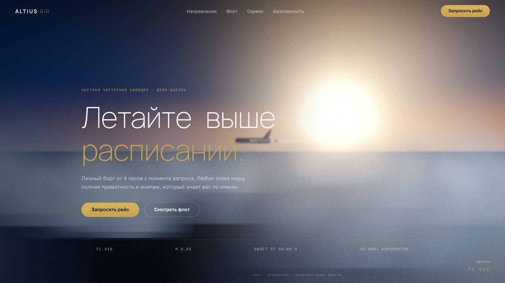
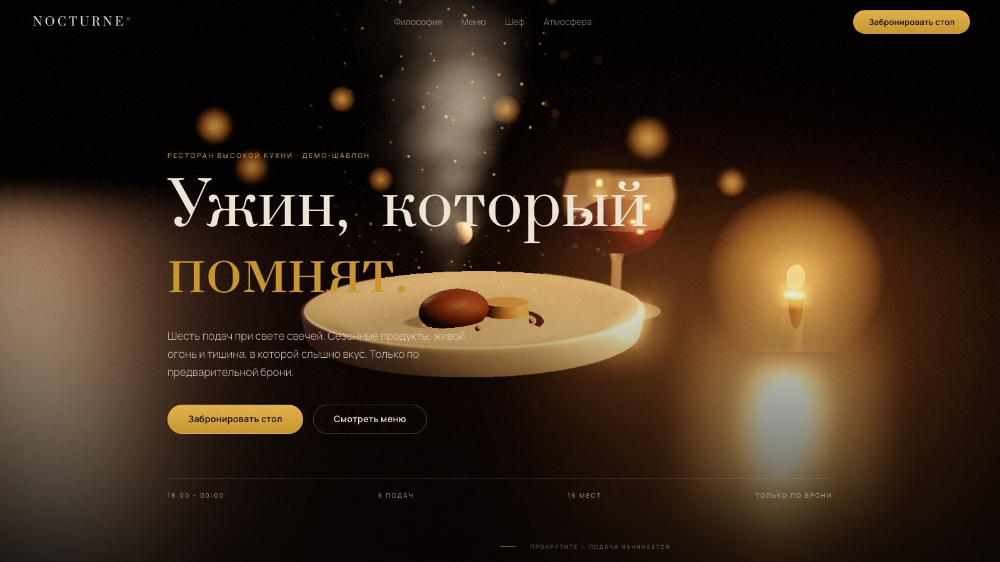
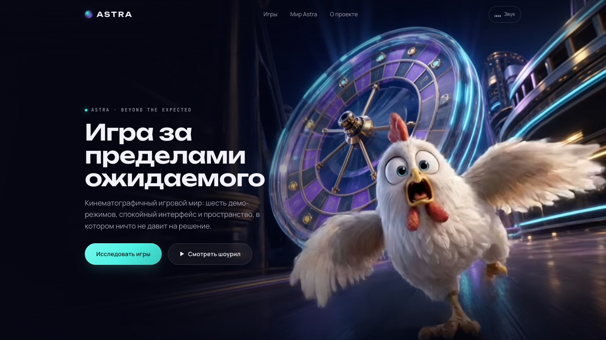

<div align="center">

# ✈️ 3D Sites

**Коллекция готовых 3D-сайтов, которые можно скопировать и сделать своими.**

Каждый сайт — это кинематографичный лендинг: живая 3D-сцена, плавный скролл
и анимации «как в кино». Никаких сборщиков и `npm install` — просто HTML, CSS и JS.

[](#-как-это-устроено)
[](https://threejs.org/)
[](https://gsap.com/)
[](https://lenis.darkroom.engineering/)

<br>

[**Посмотреть шаблоны ↓**](#-шаблоны) · [**Быстрый старт ↓**](#-быстрый-старт) · [**Частые вопросы ↓**](#-частые-вопросы)

</div>

---

## 🖼 Шаблоны

| Превью | Шаблон | О чём | Статус |
|:---:|---|---|:---:|
| [](aviation/jet-charter-dawn/) | **[ALTIUS AIR](aviation/jet-charter-dawn/)**<br>`aviation/jet-charter-dawn` | Частная чартерная авиация. Пролёт камеры сквозь облака к джету на рассвете, скролл «снижает» вас по секциям до формы заявки. | ✅ Готов |
| [](food/fine-dining-noir/) | **[NOCTURNE](food/fine-dining-noir/)**<br>`food/fine-dining-noir` | Ресторан высокой кухни. При свете свечей камера наводит фокус на блюдо — пар и капля застыли в кадре, — а скролл ведёт через вечер до брони стола. | ✅ Готов |
| [](casino/astra-casino/) | **[ASTRA](casino/astra-casino/)**<br>`casino/astra-casino` | Онлайн-казино (демо-концепт). На первом экране бесшовно крутится кинематографичное видео, а плавный скролл ведёт по галерее из шести игр — каждая оживает при наведении. 18+, не сервис азартных игр. | ✅ Готов |

> Коллекция пополняется. Запланированные ниши: 🔧 услуги и ремёсла, 🏥 медицина, 🚗 авто.

---

## 🚀 Быстрый старт

Скопировать себе любой шаблон — это три шага:

```bash
# 1. Скачайте репозиторий
git clone https://github.com/penkayone/3d-sites.git

# 2. Зайдите в папку нужного шаблона
cd 3d-sites/aviation/jet-charter-dawn

# 3. Запустите локальный сервер и откройте адрес из терминала
npx serve .
```

Готово — сайт открылся в браузере. 🎉

> [!IMPORTANT]
> Просто **дважды кликнуть по `index.html` не получится** — браузер заблокирует
> 3D-модули (это ограничение самих браузеров для файлов, открытых «с диска»).
> Нужен любой локальный сервер: `npx serve`, Live Server в VS Code / WebStorm
> или `python3 -m http.server`. Подробнее — в README каждого шаблона.

Внутри каждого шаблона лежит **свой README с пошаговым гайдом**: как запустить,
что и где заменить на свои тексты/контакты/цвета. Начните с него —
например, [гайд по ALTIUS AIR](aviation/jet-charter-dawn/README.md).

---

## 🧩 Как это устроено

Всё сделано максимально просто, чтобы шаблон можно было забрать и использовать без опыта в сборщиках:

- **Чистые HTML + CSS + JS.** Ни Webpack, ни Vite, ни `node_modules` — нечему ломаться.
- **Библиотеки грузятся с CDN** прямо в `index.html`: [Three.js](https://threejs.org/) (3D),
  [GSAP + ScrollTrigger](https://gsap.com/) (анимации по скроллу), [Lenis](https://lenis.darkroom.engineering/) (плавный скролл).
- **Каждый шаблон самодостаточен.** Скопировали одну папку — получили целый рабочий сайт,
  который ни от чего в репозитории не зависит.

Структура любого шаблона одинаковая:

```
category/site-name/
├── index.html      ← вся разметка страницы
├── css/style.css   ← все стили
├── js/*.js         ← 3D-сцена и анимации
├── assets/         ← место для ваших картинок и 3D-моделей
└── README.md       ← пошаговый гайд по этому шаблону
```

## 📁 Категории

| Папка | Ниша |
|---|---|
| `aviation/` | ✈️ Авиация |
| `food/` | 🍽 Еда и рестораны |
| `casino/` | 🎰 Казино (демо-концепты) |
| `trades/` | 🔧 Ремёсла и услуги |
| `medical/` | 🏥 Медицина |
| `automotive/` | 🚗 Авто |
| `other/` | 📦 Прочее |

---

## ❓ Частые вопросы

<details>
<summary><b>Открываю index.html — а там чёрный/пустой экран. Что делать?</b></summary>
<br>

Скорее всего, вы открыли файл двойным кликом (адрес в браузере начинается с `file://`).
Запустите через локальный сервер — см. [Быстрый старт](#-быстрый-старт).
</details>

<details>
<summary><b>Нужен ли интернет?</b></summary>
<br>

Да, при первом открытии: библиотеки (Three.js, GSAP, Lenis) и шрифты подключены через CDN.
Сами шаблоны не грузят никаких тяжёлых ассетов — вся графика рисуется кодом.
</details>

<details>
<summary><b>Могу ли я взять шаблон для своего проекта / клиента?</b></summary>
<br>

Да, для этого они и сделаны. Все названия компаний, отзывы и цифры в шаблонах — вымышленные
заглушки, помеченные словом «ДЕМО». В README каждого шаблона расписано, что заменить на своё.
</details>

<details>
<summary><b>Будет ли сайт работать на телефоне и слабом ноутбуке?</b></summary>
<br>

Да. Шаблоны сами определяют слабые устройства и включают облегчённый режим 3D,
а без поддержки WebGL показывают красивый статичный фон. Уважается и системная
настройка «уменьшить движение» (prefers-reduced-motion).
</details>

---

<div align="center">
<sub>Сделано с вниманием к деталям: производительность, адаптив, доступность и чистая консоль — в каждом шаблоне.</sub>
</div>
