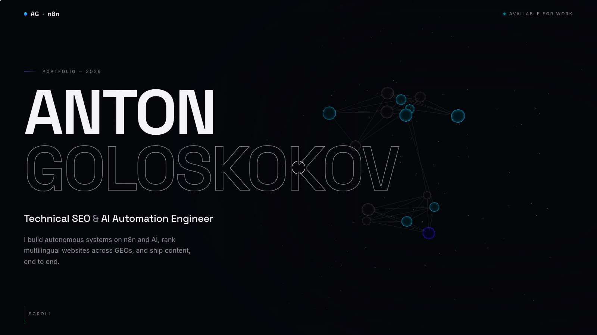
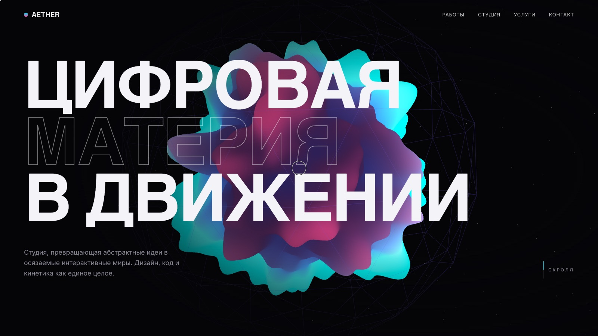
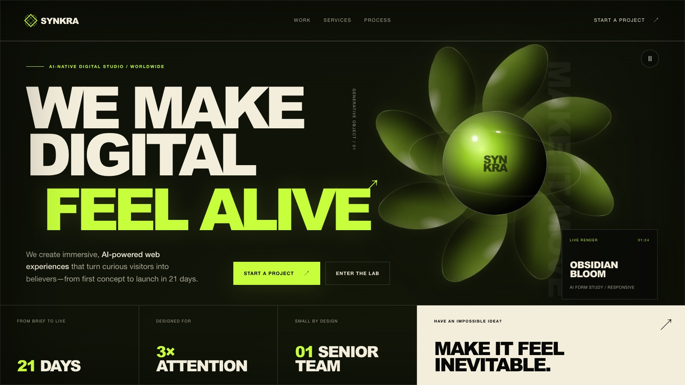
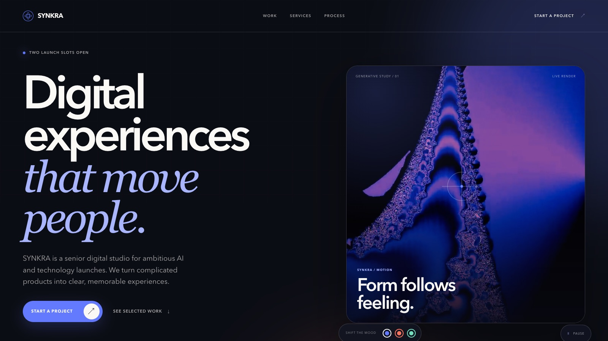

<div align="center">

# 🌐 3D Sites

[](#-стек-и-как-открыть-локально)
[](#-стек-и-как-открыть-локально)
[](#-стек-и-как-открыть-локально)
[](https://threejs.org/)
[](https://gsap.com/)

**[Русский](#-русский)  ·  [English](#-english)**

</div>

---

## 🇷🇺 Русский

**Коллекция кинематографичных 3D-сайтов на чистом вебе: живые сцены, плавный скролл и анимации как в кино.**

Здесь собраны 3D-лендинги, разложенные по нишам. Каждый сайт, это отдельная папка с живой 3D-сценой, плавным скроллом и анимациями по секциям. Почти все сделаны на чистых HTML, CSS и JS, библиотеки грузятся с CDN, так что копируете папку и получаете готовый сайт. Одно исключение, личное портфолио, оно собрано на Vite.

### 🗂 Сайты по категориям

#### ✈️ Авиация, `aviation/`

| Превью | Сайт | О чем |
|:---:|---|---|
| [](aviation/jet-charter-dawn/) | **[ALTIUS AIR](aviation/jet-charter-dawn/)**<br>`aviation/jet-charter-dawn` | Частная чартерная авиация. Камера летит сквозь облака к джету на рассвете, а скролл плавно опускает вас по секциям до формы заявки. |

#### 🍽 Еда и рестораны, `food/`

| Превью | Сайт | О чем |
|:---:|---|---|
| [](food/fine-dining-noir/) | **[NOCTURNE](food/fine-dining-noir/)**<br>`food/fine-dining-noir` | Ресторан высокой кухни. При свете свечей камера наводится на блюдо, пар и капля застыли в кадре, а скролл ведет через вечер до брони стола. |

#### 🎰 Казино, демо-концепты, `casino/`

| Превью | Сайт | О чем |
|:---:|---|---|
| [](casino/astra-casino/) | **[ASTRA](casino/astra-casino/)**<br>`casino/astra-casino` | Онлайн-казино, демо-концепт. На первом экране бесшовно крутится кинематографичное видео, а скролл ведет по галерее из шести игр, каждая оживает при наведении. 18+, не сервис азартных игр. |

#### 👤 Портфолио, `portfolio/`

| Превью | Сайт | О чем |
|:---:|---|---|
| [](portfolio/cinematic-portfolio/) | **[Cinematic Portfolio](portfolio/cinematic-portfolio/)**<br>`portfolio/cinematic-portfolio` | Личное портфолио инженера по Technical SEO и AI-автоматизации. Разреженная сеть нод в стиле n8n живет в правой части экрана, а скролл ведет через семь актов, от манифеста до контактов. Собрано на Vite, three.js, GSAP и Lenis. |

#### 📦 Прочее, `other/`

| Превью | Сайт | О чем |
|:---:|---|---|
| [](other/aether-studio/) | **[AETHER](other/aether-studio/)**<br>`other/aether-studio` | Лендинг цифровой студии. В центре живой 3D-блоб на шейдерах и облако частиц, свой курсор, кинетическая типографика и анимации по скроллу. |
| [](other/aurora-studio/) | **[AURORA](other/aurora-studio/)**<br>`other/aurora-studio` | Студия цифровых пространств. Справа сплетение объемных фигур в каркасной сфере, оно вращается и следует за курсором, а скролл ведет через проекты и подход к контакту. Чистые HTML, CSS и JS. |
| [](other/synkra-immersive/) | **[SYNKRA Immersive](other/synkra-immersive/)**<br>`other/synkra-immersive` | AI-студия, кинематографичный лендинг с лаймовым акцентом «We make digital feel alive», видео, интерактивной арт-лабораторией и формой заявки. Собран на Next.js и vinext. |
| [](other/synkra-digital/) | **[SYNKRA Digital](other/synkra-digital/)**<br>`other/synkra-digital` | Тот же бренд SYNKRA, но сдержанный, «сеньорный» вариант в кобальтовых тонах с переключателем настроения и генеративным видео. Тоже на Next.js и vinext. |

> Категории в работе: 🔧 ремесла и услуги (`trades/`), 🏥 медицина (`medical/`), 🚗 авто (`automotive/`). Скоро наполнятся.

### 🧩 Стек и как открыть локально

Библиотеки одни и те же во всех сайтах: [Three.js](https://threejs.org/) для 3D, [GSAP и ScrollTrigger](https://gsap.com/) для анимаций по скроллу, [Lenis](https://lenis.darkroom.engineering/) для плавного скролла.

**Обычные шаблоны** (авиация, еда, казино, AETHER, AURORA) сделаны на чистых HTML, CSS и JS без сборщика. Библиотеки подключены с CDN прямо в `index.html`. Структура у всех одинаковая:

```
category/site-name/
├── index.html      ← вся разметка страницы
├── css/style.css   ← все стили
├── js/*.js         ← 3D-сцена и анимации
└── assets/         ← место для картинок и 3D-моделей
```

Запуск, любой локальный сервер (двойной клик по файлу не подойдет, браузер заблокирует 3D-модули):

```bash
cd 3d-sites/aviation/jet-charter-dawn
npx serve .
```

**Портфолио** собрано на Vite, поэтому запускается иначе:

```bash
cd 3d-sites/portfolio/cinematic-portfolio
npm install
npm run dev      # локальный сервер, адрес выведется в терминал
npm run build    # сборка в dist/
```

**Сайты SYNKRA** (`other/synkra-immersive`, `other/synkra-digital`) собраны на Next.js и [vinext](https://github.com/cloudflare/vinext) (запуск под Cloudflare). Нужен Node.js `>=22.13.0`:

```bash
cd 3d-sites/other/synkra-immersive
npm install
npm run dev      # локальный сервер, адрес выведется в терминал
npm run build    # сборка
```

Внутри каждого сайта лежит свой README с пошаговым гайдом: что и где заменить на свои тексты, контакты и цвета.

---

## 🇬🇧 English

**A collection of cinematic 3D websites on the plain web: living scenes, smooth scroll and animations like in a film.**

These are 3D landing pages sorted by niche. Each site is its own folder with a living 3D scene, smooth scroll and section animations. Almost all are built with plain HTML, CSS and JS, the libraries load from a CDN, so you copy a folder and get a working site. One exception, a personal portfolio, is built with Vite.

### 🗂 Sites by category

#### ✈️ Aviation, `aviation/`

| Preview | Site | About |
|:---:|---|---|
| [](aviation/jet-charter-dawn/) | **[ALTIUS AIR](aviation/jet-charter-dawn/)**<br>`aviation/jet-charter-dawn` | Private jet charter. The camera flies through clouds toward a jet at dawn, and scrolling gently lowers you through the sections down to the booking form. |

#### 🍽 Food and restaurants, `food/`

| Preview | Site | About |
|:---:|---|---|
| [](food/fine-dining-noir/) | **[NOCTURNE](food/fine-dining-noir/)**<br>`food/fine-dining-noir` | Fine dining. By candlelight the camera focuses on the dish, steam and a drop frozen in frame, and scrolling leads through the evening to a table reservation. |

#### 🎰 Casino, demo concepts, `casino/`

| Preview | Site | About |
|:---:|---|---|
| [](casino/astra-casino/) | **[ASTRA](casino/astra-casino/)**<br>`casino/astra-casino` | Online casino, a demo concept. A cinematic video loops seamlessly on the first screen, and scrolling walks a gallery of six games, each coming alive on hover. 18+, not a gambling service. |

#### 👤 Portfolio, `portfolio/`

| Preview | Site | About |
|:---:|---|---|
| [](portfolio/cinematic-portfolio/) | **[Cinematic Portfolio](portfolio/cinematic-portfolio/)**<br>`portfolio/cinematic-portfolio` | A personal portfolio for a Technical SEO and AI Automation engineer. A sparse n8n-style node network lives in the right side of the screen, and scrolling moves through seven acts, from manifesto to contact. Built with Vite, three.js, GSAP and Lenis. |

#### 📦 Other, `other/`

| Preview | Site | About |
|:---:|---|---|
| [](other/aether-studio/) | **[AETHER](other/aether-studio/)**<br>`other/aether-studio` | A digital studio landing. A living shader blob and a particle cloud at the center, a custom cursor, kinetic typography and scroll animations. |
| [](other/aurora-studio/) | **[AURORA](other/aurora-studio/)**<br>`other/aurora-studio` | A digital-spaces studio. A tangle of volumetric shapes in a wireframe sphere rotates and follows the cursor on the right, and scrolling leads through projects and approach to contact. Plain HTML, CSS and JS. |
| [](other/synkra-immersive/) | **[SYNKRA Immersive](other/synkra-immersive/)**<br>`other/synkra-immersive` | An AI studio, a cinematic landing with a lime accent, "We make digital feel alive", video, an interactive art lab and a brief form. Built with Next.js and vinext. |
| [](other/synkra-digital/) | **[SYNKRA Digital](other/synkra-digital/)**<br>`other/synkra-digital` | The same SYNKRA brand, but a restrained, "senior" variant in cobalt tones with a mood switcher and generative video. Also on Next.js and vinext. |

> Categories in progress: 🔧 trades and services (`trades/`), 🏥 medical (`medical/`), 🚗 automotive (`automotive/`). Coming soon.

### 🧩 Stack and how to run locally

The libraries are the same across every site: [Three.js](https://threejs.org/) for 3D, [GSAP and ScrollTrigger](https://gsap.com/) for scroll animation, [Lenis](https://lenis.darkroom.engineering/) for smooth scroll.

**The plain templates** (aviation, food, casino, AETHER, AURORA) are built with plain HTML, CSS and JS, no bundler. Libraries are loaded from a CDN right in `index.html`. They all share the same structure:

```
category/site-name/
├── index.html      ← all page markup
├── css/style.css   ← all styles
├── js/*.js         ← 3D scene and animation
└── assets/         ← a place for images and 3D models
```

To run, use any local server (double-clicking the file will not work, the browser blocks 3D modules):

```bash
cd 3d-sites/aviation/jet-charter-dawn
npx serve .
```

**The portfolio** is built with Vite, so it runs differently:

```bash
cd 3d-sites/portfolio/cinematic-portfolio
npm install
npm run dev      # local server, the URL is printed in the terminal
npm run build    # build into dist/
```

**The SYNKRA sites** (`other/synkra-immersive`, `other/synkra-digital`) are built with Next.js and [vinext](https://github.com/cloudflare/vinext) (running on Cloudflare). They need Node.js `>=22.13.0`:

```bash
cd 3d-sites/other/synkra-immersive
npm install
npm run dev      # local server, the URL is printed in the terminal
npm run build    # build
```

Each site has its own README with a step-by-step guide: what to change and where for your own copy, contacts and colors.

---

<div align="center">
<sub>Каждый сайт с вниманием к деталям: производительность, адаптив, доступность и чистая консоль.  ·  Every site with attention to detail: performance, responsive layout, accessibility and a clean console.</sub>
</div>
