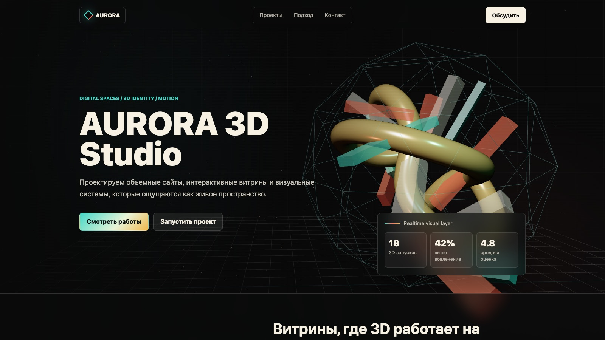

<div align="center">

# ◆ AURORA 3D Studio



**[Русский](#-русский)  ·  [English](#-english)**

</div>

---

## 🇷🇺 Русский

**3D-лендинг для студии цифровых пространств.**

На первом экране, справа, живая 3D-сцена: сплетение объёмных фигур внутри каркасной сферы, оно мягко вращается и реагирует на курсор. Слева, заголовок, короткое описание и две кнопки. Дальше обычным скроллом открываются проекты, подход студии и блок контакта. Карточки чуть наклоняются под курсором.

> [!NOTE]
> Это **шаблон**, а не сайт реальной студии. Название «AURORA», проекты, цифры (18 запусков, 42%, 4.8) и почта, вымышленные заглушки. Ниже по шагам, как заменить их на своё.

### 🚀 Как запустить

Нужен любой локальный сервер, двойной клик по `index.html` **не сработает** (браузеры блокируют 3D-модули у файлов, открытых с диска, адрес `file://`).

**Вариант 1, терминал (самый простой):**

```bash
cd other/aurora-studio
npx serve .
```

Откройте адрес из терминала (обычно `http://localhost:3000`).

**Вариант 2, VS Code / WebStorm:** правый клик по `index.html`, «Open with Live Server».

**Вариант 3, Python:**

```bash
cd other/aurora-studio
python3 -m http.server 8000
# открыть http://localhost:8000
```

> [!IMPORTANT]
> Нужен интернет: Three.js подключается через CDN. Если он вдруг недоступен, сцена сама переключается на облегчённый запасной вариант на обычном canvas, сайт не сломается.

### ✏️ Как сделать сайт своим

Всё правится в обычном текстовом редакторе. Разметка, `index.html`, стили и палитра, `styles.css`, 3D-сцена и анимации, `app.js`.

#### Шаг 1. Название студии

Откройте `index.html` и через поиск (`Ctrl+F` / `Cmd+F`) найдите все `AURORA`. Название встречается в трёх местах:

| Где | Что искать |
|---|---|
| Вкладка браузера | `<title>AURORA 3D Studio</title>` в самом верху файла |
| Логотип в шапке | ссылка `class="brand"` (там `aria-label="AURORA"` и текст `AURORA`) |
| Большой заголовок первого экрана | `<h1 id="hero-title">AURORA 3D Studio</h1>` |

#### Шаг 2. Тексты и секции

Каждая секция подписана своим `id`, найдите нужную и поменяйте текст внутри:

| Секция | `id` в файле | Что внутри |
|---|---|---|
| Первый экран | `id="top"` (секция `.hero`) | Заголовок, описание, кнопки и панель с цифрами (`.metric-grid`) |
| Проекты | `id="projects"` | Три карточки `.project-card` (номер, название, описание) |
| Подход | `id="process"` | Три шага `.step` на таймлайне |
| Контакт | `id="contact"` (подвал) | Заголовок-призыв и кнопка с почтой |

#### Шаг 3. Контакты

Почта лежит в подвале, в кнопке `mailto:hello@example.com` (секция `id="contact"`). Замените адрес на свой, при желании добавьте телефон или ссылки на соцсети рядом.

#### Шаг 4. Форма

Формы на сайте **нет**, связь идёт через кнопку-ссылку `mailto`. Если нужна именно форма с отправкой заявок, добавьте её и подключите любой сервис форм ([Formspree](https://formspree.io/), [Web3Forms](https://web3forms.com/)) или свой бэкенд.

#### Шаг 5. Цвета и шрифты

Вся палитра собрана в начале `styles.css`, в блоке `:root`, поменяли значение в одном месте, и оно поменялось по всему сайту:

```css
:root {
  --ink: #080909;    /* основной тёмный фон      */
  --paper: #f7f1e4;  /* светлый цвет текста      */
  --muted: #b7b2a6;  /* приглушённый текст       */
  --teal: #44d7c7;   /* акцент, бирюзовый        */
  --coral: #ff725f;  /* акцент, коралловый       */
  --gold: #f0b64a;   /* акцент, золотой          */
  --violet: #9a94ff; /* акцент, сиреневый        */
}
```

Шрифты, системные (тот, что стоит у пользователя в системе), внешние файлы не подгружаются, поэтому русский текст отображается сразу и без настроек.

> [!TIP]
> Цвета сцены заданы отдельно, прямо в `app.js` (цвета источников света и материалов, значения вида `0x44d7c7`, `0xff725f`, `0xf0d28a`). Они совпадают с палитрой из `:root`. Если меняете цвета кардинально, загляните и туда, чтобы 3D-сцена не выбивалась из новой гаммы.

#### Шаг 6. Свои ассеты

Вся графика рисуется кодом, внешних файлов нет, поэтому папки `assets` тут нет. Если добавите свои картинки или 3D-модели, создайте `assets/` и складывайте их туда.

### 📁 Что в какой папке

```
index.html    вся разметка + подключение библиотек с CDN
styles.css    все стили: палитра (:root), секции, адаптив
app.js        3D-сцена (three.js), наклон карточек, появление секций по скроллу
```

### 🔧 Технические детали

<details>
<summary><b>3D-сцена</b></summary>
<br>

- Three.js грузится динамическим импортом с CDN. Если библиотека недоступна, срабатывает `initCanvasFallback()`, лёгкая запасная сцена на обычном 2D-canvas, чтобы первый экран не оставался пустым.
- В сцене: сплетение объёмных фигур (торы и кольца) внутри каркасной икосаэдр-сферы, три цветных источника света (бирюзовый, коралловый) плюс мягкий заполняющий и ключевой свет.
- Вращение медленное и постоянное, лёгкий параллакс следует за курсором.
</details>

<details>
<summary><b>Скролл и анимации</b></summary>
<br>

- Появление блоков (`.reveal`) по скроллу через `IntersectionObserver`, без тяжёлых библиотек.
- Карточки проектов (`[data-tilt]`) слегка наклоняются в 3D под курсором.
- Плавная прокрутка к секциям по кликам на якорные ссылки.
</details>

<details>
<summary><b>Поведение на устройствах</b></summary>
<br>

- Наклон карточек и параллакс работают на десктопе, на тач-устройствах ведут себя спокойно.
- Тёмная тема задана через `color-scheme: dark`.
</details>

### ❓ Если что-то пошло не так

| Проблема | Решение |
|---|---|
| Чёрный или пустой экран | Вы открыли файл двойным кликом (`file://`). Запустите локальный сервер, см. [«Как запустить»](#-как-запустить) |
| Вместо объёмной сцены простая фигура | Three.js не загрузился с CDN (нет интернета), сработал запасной canvas-вариант. Проверьте соединение |
| Тормозит на слабом ноутбуке | Это нормально для 3D, закройте лишние вкладки. Сцена и так ограничивает нагрузку на экранах Retina |

---

## 🇬🇧 English

**A 3D landing page for a digital-spaces studio.**

The first screen has a living 3D scene on the right: a tangle of volumetric shapes inside a wireframe sphere, gently rotating and reacting to the cursor. On the left, a headline, a short description and two buttons. Plain scrolling then reveals the projects, the studio approach and a contact block. Cards tilt slightly under the cursor.

> [!NOTE]
> This is a **template**, not a real studio site. The name "AURORA", the projects, numbers (18 launches, 42%, 4.8) and email are fictional placeholders. See below for how to make it yours.

### 🚀 Run it

You need any local server, double-clicking `index.html` **will not work** (browsers block 3D modules for files opened from disk, the `file://` scheme).

**Option 1, terminal (easiest):**

```bash
cd other/aurora-studio
npx serve .
```

Open the address printed in the terminal (usually `http://localhost:3000`).

**Option 2, VS Code / WebStorm:** right-click `index.html`, "Open with Live Server".

**Option 3, Python:**

```bash
cd other/aurora-studio
python3 -m http.server 8000
# open http://localhost:8000
```

> [!IMPORTANT]
> Internet is required: Three.js loads from a CDN. If it is unavailable, the scene falls back to a lightweight plain-canvas version on its own, so the site never breaks.

### ✏️ Make it yours

Everything is edited in a plain text editor. Markup is `index.html`, styles and palette are `styles.css`, the 3D scene and animations are `app.js`.

#### Step 1. Studio name

Open `index.html` and search (`Ctrl+F` / `Cmd+F`) for `AURORA`. The name appears in three places:

| Where | What to look for |
|---|---|
| Browser tab | `<title>AURORA 3D Studio</title>` at the very top |
| Header logo | the `class="brand"` link (`aria-label="AURORA"` and the `AURORA` text) |
| Big hero headline | `<h1 id="hero-title">AURORA 3D Studio</h1>` |

#### Step 2. Copy and sections

Each section has its own `id`, find the one you need and edit the text inside:

| Section | `id` in file | What is inside |
|---|---|---|
| Hero | `id="top"` (the `.hero` section) | Headline, description, buttons and the numbers panel (`.metric-grid`) |
| Projects | `id="projects"` | Three `.project-card` cards (number, title, description) |
| Approach | `id="process"` | Three `.step` items on a timeline |
| Contact | `id="contact"` (footer) | The call-to-action heading and the email button |

#### Step 3. Contacts

The email lives in the footer, in the `mailto:hello@example.com` button (section `id="contact"`). Replace it with your own, and add a phone or social links next to it if you like.

#### Step 4. Form

There is **no form**, contact goes through a `mailto` link-button. If you need a real form that sends leads, add one and wire it to any form service ([Formspree](https://formspree.io/), [Web3Forms](https://web3forms.com/)) or your own backend.

#### Step 5. Colors and fonts

The whole palette sits at the top of `styles.css`, in the `:root` block, change a value once and it changes everywhere:

```css
:root {
  --ink: #080909;    /* main dark background */
  --paper: #f7f1e4;  /* light text color     */
  --muted: #b7b2a6;  /* muted text           */
  --teal: #44d7c7;   /* accent, teal         */
  --coral: #ff725f;  /* accent, coral        */
  --gold: #f0b64a;   /* accent, gold         */
  --violet: #9a94ff; /* accent, violet       */
}
```

Fonts are the system font stack (whatever the visitor has installed), nothing is downloaded, so any language renders instantly with no setup.

> [!TIP]
> The scene colors are set separately, right in `app.js` (light and material colors, values like `0x44d7c7`, `0xff725f`, `0xf0d28a`). They match the `:root` palette. If you rebrand hard, update them there too so the 3D scene stays on-brand.

#### Step 6. Your own assets

All graphics are drawn in code, there are no external files, so there is no `assets` folder here. If you add images or 3D models, create an `assets/` folder and put them there.

### 📁 What is in each folder

```
index.html    all markup + CDN library tags
styles.css    all styles: palette (:root), sections, responsive
app.js        3D scene (three.js), card tilt, scroll reveals
```

### 🔧 Technical details

<details>
<summary><b>3D scene</b></summary>
<br>

- Three.js is loaded via dynamic import from a CDN. If the library is unavailable, `initCanvasFallback()` kicks in, a light backup scene on a plain 2D canvas so the first screen is never empty.
- The scene has a tangle of volumetric shapes (tori and rings) inside a wireframe icosahedron sphere, three colored lights (teal, coral) plus soft fill and key lighting.
- Rotation is slow and constant, a gentle parallax follows the cursor.
</details>

<details>
<summary><b>Scroll and animation</b></summary>
<br>

- Blocks (`.reveal`) appear on scroll via `IntersectionObserver`, no heavy libraries.
- Project cards (`[data-tilt]`) tilt slightly in 3D under the cursor.
- Smooth scrolling to sections on anchor-link clicks.
</details>

<details>
<summary><b>Device behavior</b></summary>
<br>

- Card tilt and parallax run on desktop, and stay calm on touch devices.
- Dark theme is set via `color-scheme: dark`.
</details>

### ❓ If something goes wrong

| Problem | Fix |
|---|---|
| Black or empty screen | You opened the file by double-click (`file://`). Start a local server, see [Run it](#-english) |
| A simple shape instead of the full scene | Three.js did not load from the CDN (no internet), the backup canvas version took over. Check your connection |
| Slow on a weak laptop | Normal for 3D, close extra tabs. The scene already caps the load on Retina screens |
</content>
</invoke>
